# Django Multi-Factor Authentication

## Features
* TOTP and FIDO2 Authentication

## Preview

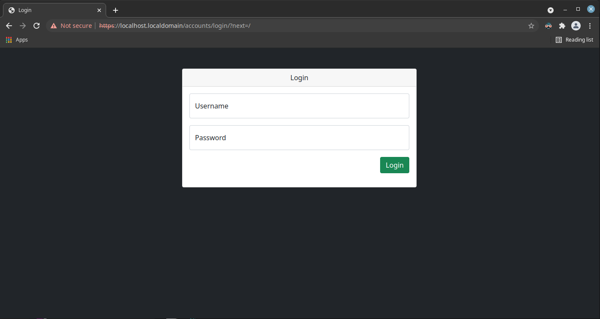

There is a sample settings page where you can easily change some attributes of the user you are logged in with.
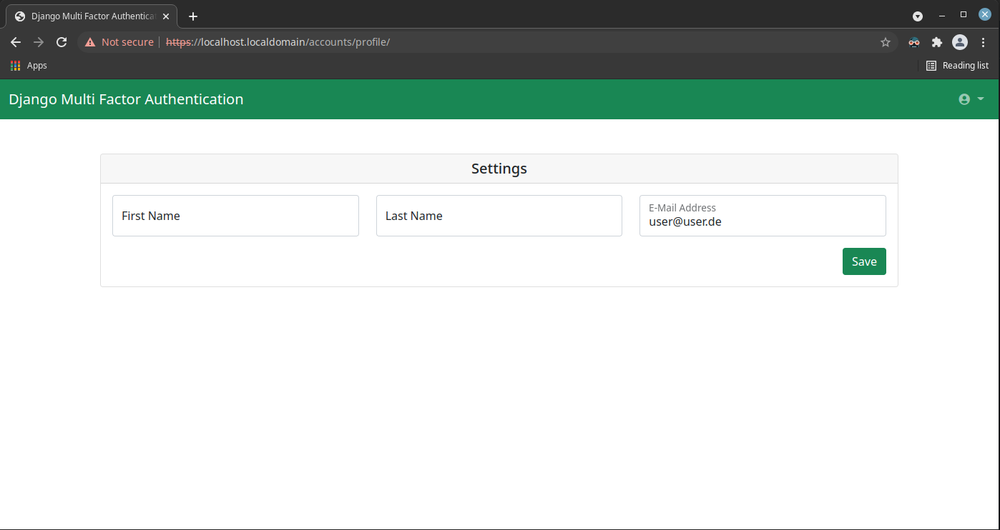

The security page allows you to manage multi-factor authentication keys.
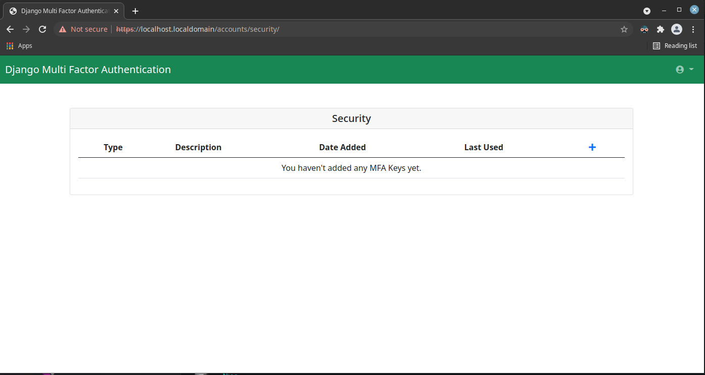

You may choose between TOTP and FIDO2.
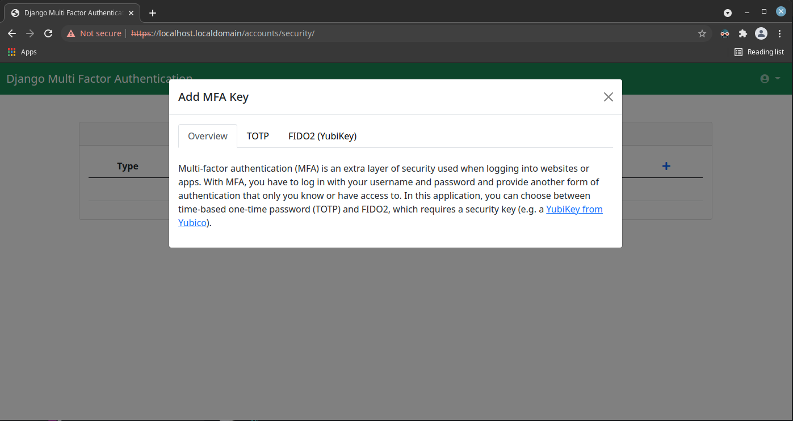

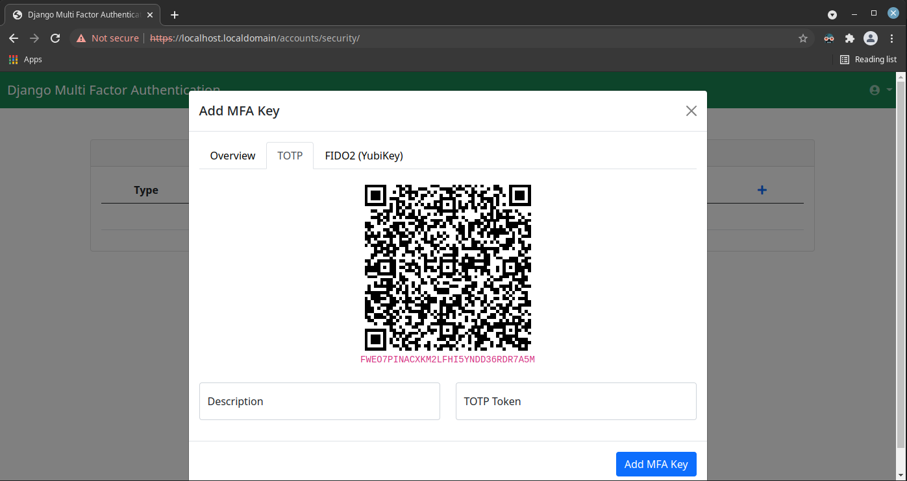

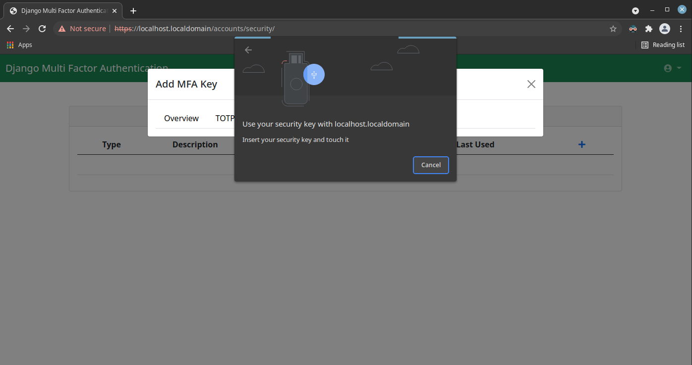

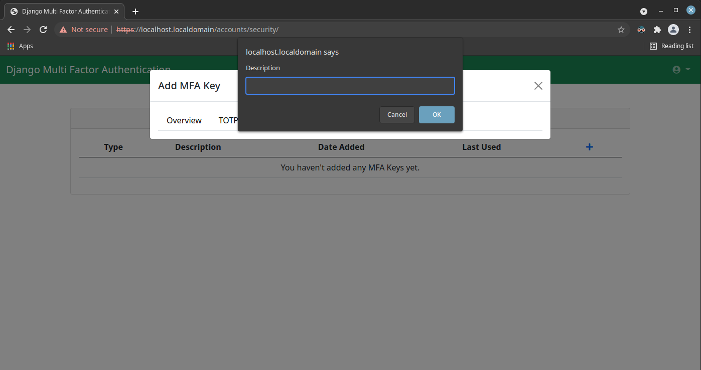

Besides the description, you may update the state (enabled or disabled) of the keys, you can also delete the mfa keys here.
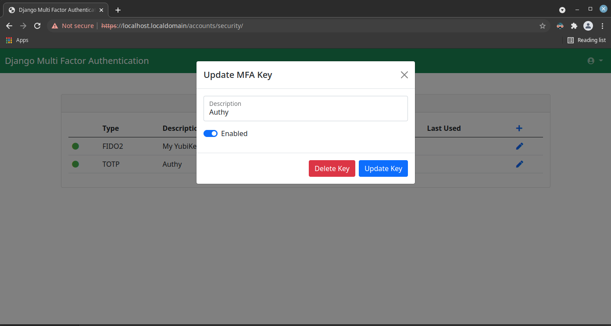

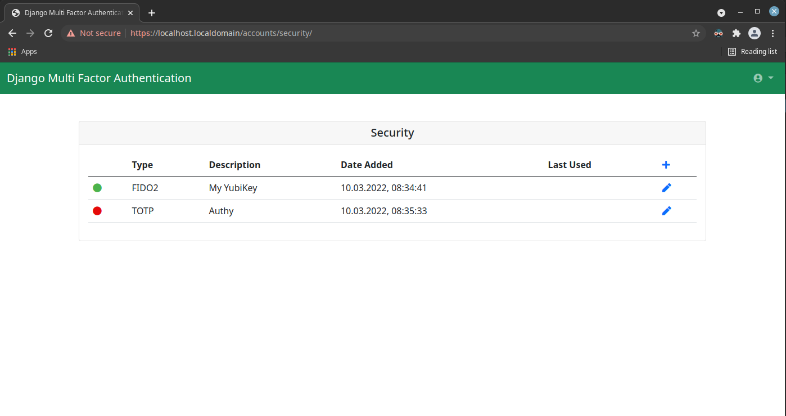

Logging in with mfa enabled means you have to complete one of the configured challenges (the modal where you can choose will only show up if more than one mfa key is configured).
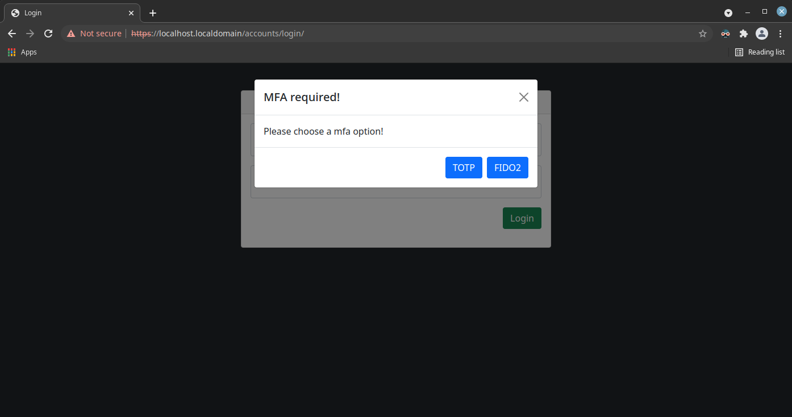

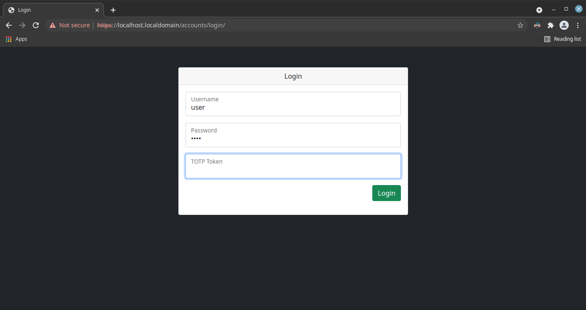

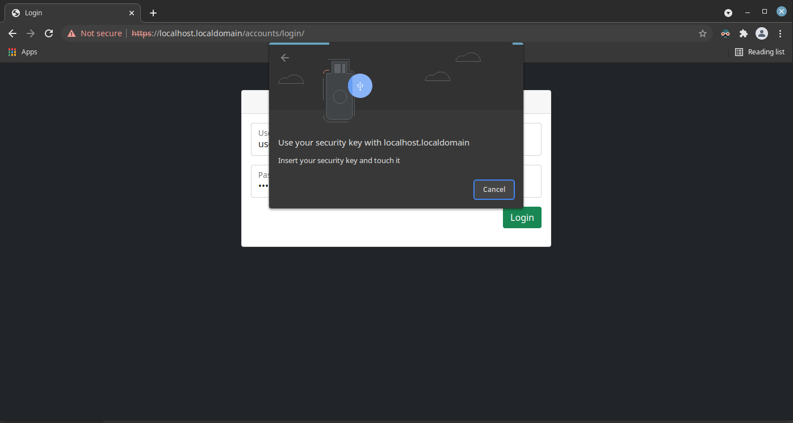
